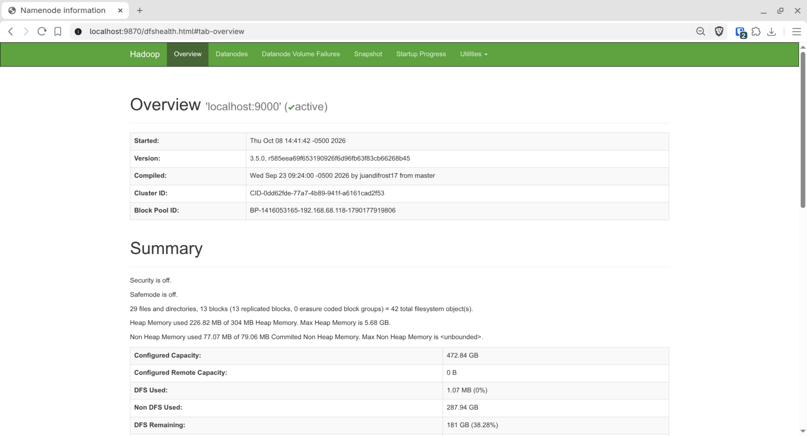
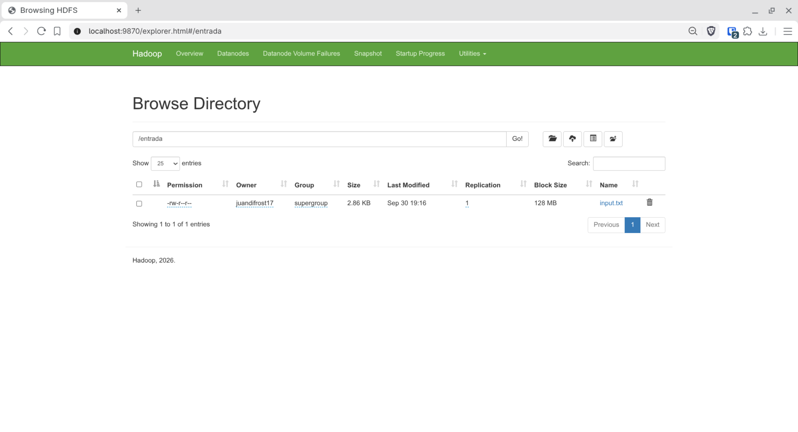
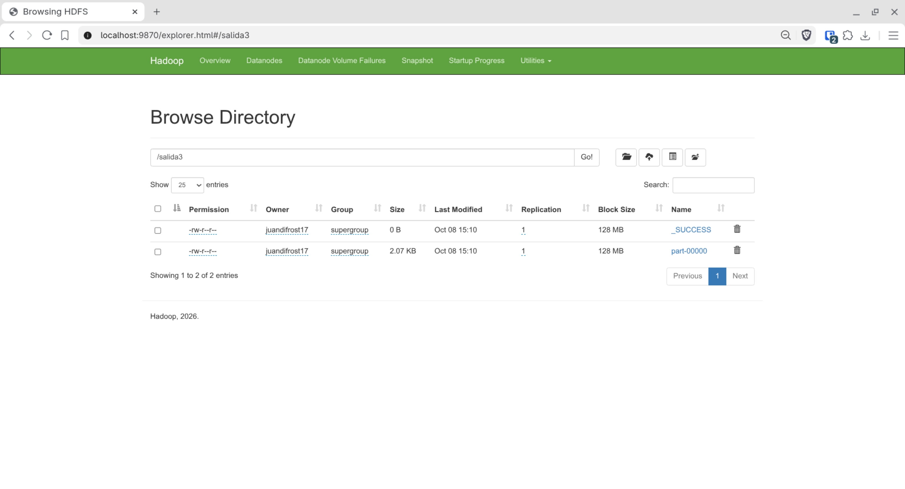
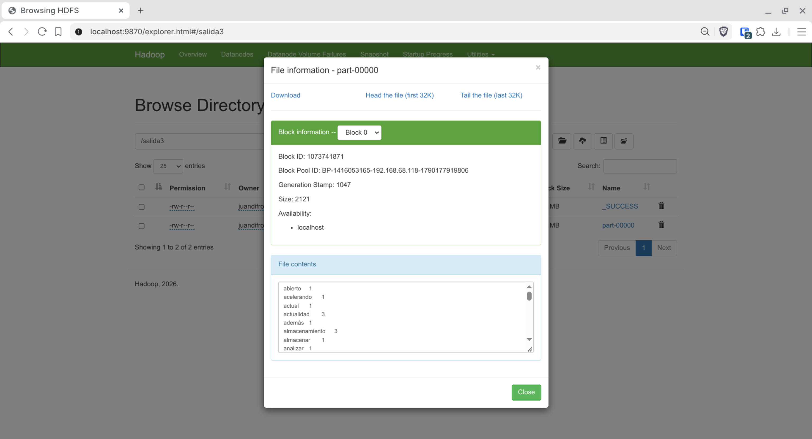
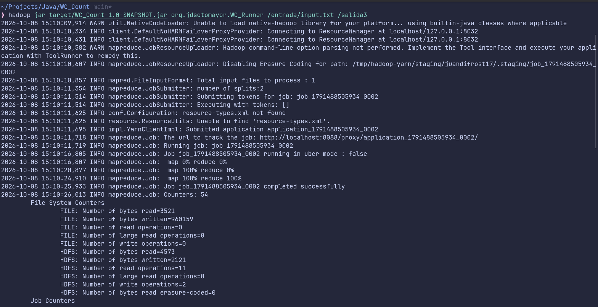
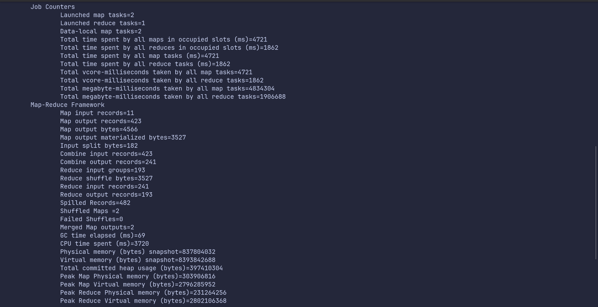
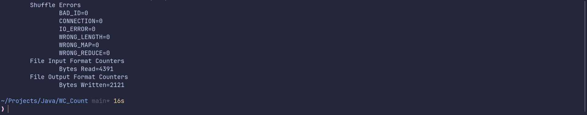
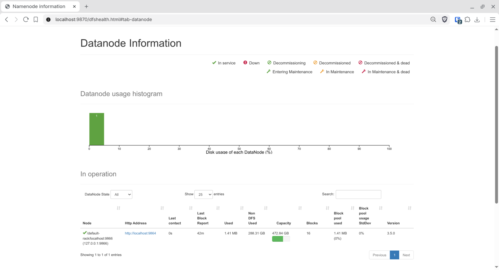

# Actividad 2: WordCount con Hadoop MapReduce

Programa de conteo de palabras (*WordCount*) sobre Hadoop MapReduce, modificado para que el conteo **no distinga entre mayúsculas y minúsculas** y **ignore los caracteres especiales**.

## Objetivo

El WordCount original separa el texto únicamente por espacios, por lo que variantes de una misma palabra se contaban por separado: `datos`, `datos,` y `datos.` eran tres claves distintas, igual que `El` y `el`. La modificación hace que todas se cuenten como una sola palabra.

## Estructura del proyecto

```
.
├── pom.xml                                    # Maven: Hadoop 3.5.0 (hadoop-common y mapreduce-client-core)
├── src/main/java/org/jdsotomayor/
│   ├── WC_Mapper.java                         # Divide cada línea en palabras y las normaliza (aquí está el cambio)
│   ├── WC_Reducer.java                        # Suma las ocurrencias de cada palabra (también se usa como combiner)
│   └── WC_Runner.java                         # Configura y lanza el job
├── entrada/input.txt                          # Archivo de entrada que se sube a HDFS
├── capturas/                                  # Evidencia de HDFS y de la ejecución del job
└── resultado/part-00000                       # Archivo resultante del conteo
```

## Qué se modificó

Solo cambió el método `map()` de `WC_Mapper.java`. Por cada token de la línea:

1. Se convierte a minúsculas con `toLowerCase(Locale.ROOT)`, para que el resultado no dependa de la configuración regional del sistema.
2. Se eliminan todos los caracteres que no sean letras ni dígitos, con la expresión regular `[^\p{L}\p{N}]`. Al usar propiedades Unicode, las **letras con tilde y la ñ se conservan** (`análisis`, `canción`), ya que en español son letras y no caracteres especiales.
3. Si el token queda vacío (por ejemplo `---` o `...`), se descarta para no contar una palabra vacía.

```java
String clean = tokenizer.nextToken().toLowerCase(Locale.ROOT).replaceAll("[^\\p{L}\\p{N}]", "");
if (clean.isEmpty()) {
    continue;
}
word.set(clean);
output.collect(word, one);
```

El reducer y el runner no necesitaron cambios.

### Antes y después

Fragmento del resultado sobre el mismo archivo de entrada (`/entrada/input.txt`):

| Antes (`/salida2`) | Después (`/salida3`) |
|---|---|
| `datos` 16, `datos,` 4, `datos.` 1 | `datos` 21 |
| `El` 2, `el` 10 | `el` 12 |
| `(Internet` 1 | `internet` 1 |
| `Hadoop,` 1 | `hadoop` 1 |
| 206 claves distintas | 193 claves distintas |

El total de palabras no cambia (423): solo se agrupan correctamente.

## Compilación y ejecución

Requisitos: JDK, Maven y Hadoop 3.5.0 con HDFS en funcionamiento.

```bash
# 1. Compilar y generar el jar
mvn clean package

# 2. Subir el archivo de entrada a HDFS
hdfs dfs -mkdir -p /entrada
hdfs dfs -put entrada/input.txt /entrada/

# 3. Ejecutar el job (el directorio de salida no debe existir)
hadoop jar target/WC_Count-1.0-SNAPSHOT.jar org.jdsotomayor.WC_Runner /entrada/input.txt /salida3

# 4. Ver el resultado
hdfs dfs -cat /salida3/part-00000
```

## Evidencia en HDFS

Capturas tomadas desde la interfaz web del NameNode (`http://localhost:9870`) y desde la terminal.

### 1. Estado del NameNode
Pestaña *Overview* del NameNode (`localhost:9000`) activo, versión Hadoop 3.5.0, con *Safemode* desactivado.



### 2. DataNodes activos
Pestaña *Datanodes*: un DataNode en servicio (`localhost:9866`), con 16 bloques, versión 3.5.0 y capacidad de 472.84 GB.


### 3. Directorio `/entrada` en HDFS
Contiene el archivo `input.txt` (2.86 KB), con replicación 1 y tamaño de bloque de 128 MB.



### 4. Detalle del archivo de entrada `input.txt`
Información del bloque (2927 bytes, disponible en `localhost`) y el contenido original del texto.



### 5. Directorio de salida `/salida3`
Se observan `_SUCCESS` (el job terminó correctamente) y `part-00000` (el resultado, de 2.07 KB).


### 6. Detalle del archivo resultante `part-00000`
Información del bloque (2121 bytes) y el inicio del contenido, con las palabras ya en minúsculas y sin signos de puntuación.



### 7. Ejecución del job
Comando `hadoop jar` y avance del job hasta `map 100% reduce 100%` y `completed successfully`.



Contadores del job. `Map output records=423` corresponde a las palabras del texto y `Reduce output records=193` a las palabras distintas del resultado.



Final de la ejecución, sin errores de *shuffle*.



### 8. Contenido del resultado
Salida de `hdfs dfs -cat /salida3/part-00000`.



## Resultado

El archivo resultante del conteo está en [`resultado/part-00000`](resultado/part-00000). Cada línea tiene el formato `palabra<TAB>cantidad`, ordenada alfabéticamente.
